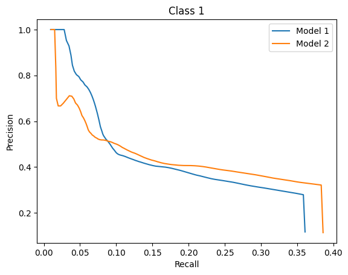
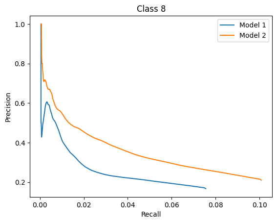
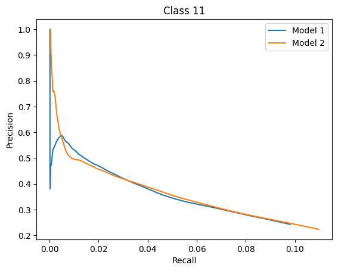
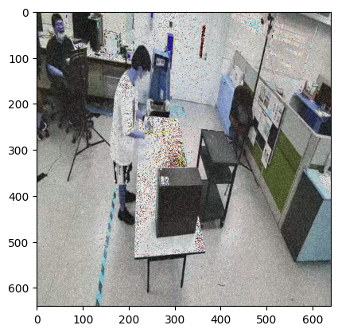
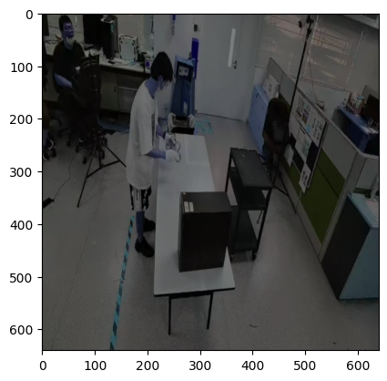
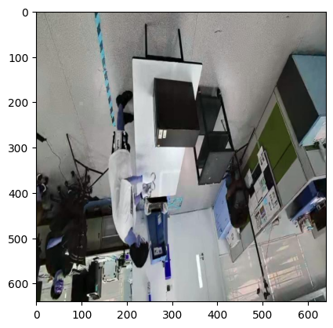
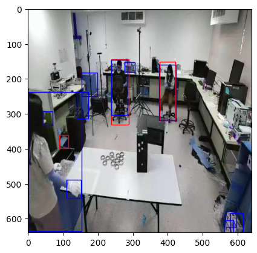

<h2>Tasks 1 and 2</h2>: 

<b>.Compare Model 1 and Model 2 on the TechTrack dataset using standard object-detection metrics:</b>

In order to compar model 1 and model 2, we need to compare their precision and recall for each of the classes to determine which classes are classified best by each model. To do this, we will compute the precision recall curves. The area under these is an indicator of well the model classifies the object. In the table below, we compute the area under the curve for each class for each precision-recall curve for the two models:

<table style="width:100%">
  <tr>
    <th>Class</th>
    <th> 1</th>
    <th> 2</th>
    <th> 3</th>
    <th> 4</th>
    <th> 5</th>
    <th> 6</th>
    <th> 7</th>
    <th> 8</th>
    <th> 9</th>
    <th> 10</th>
  </tr>
  <tr>
    <td>
Model 1</td>
    <td>
 0.1620</td>
    <td>
0.0535</td>
    <td>
 0.2039</td>
    <td>
0.0022</td>
    <td>
0.0915</td>
    <td>
0.0057</td>
    <td>
 0.0539</td>
    <td>
0.0201</td>
    <td>
0.0008</td>
    <td>
0.0804</td>
  </tr>
  <tr>
    <td>
Model 2</td>
    <td>
0.1678</td>
    <td>
0.0507</td>
    <td>
0.3160</td>
    <td>
0.0053</td>
    <td>
 0.1004</td>
    <td>
0.0037</td>
    <td>
0.0843</td>
    <td>
0.0359</td>
    <td>
0.0080</td>
    <td>
0.0915</td>
  </tr>
</table>

 

<table style="width:100%">
  <tr>
    <th>Class</th>
    <th> 11</th>
    <th> 12</th>
    <th> 13</th>
    <th> 14</th>
    <th> 15</th>
    <th> 16</th>
    <th> 17</th>
    <th> 18</th>
    <th> 19</th>
    <th> 20</th>
  </tr>
  <tr>
    <td>
Model 1</td>
    <td>
0.0365 </td>
    <td>
0.314</td>
    <td>
 0.0307</td>
    <td>
0.0244</td>
    <td>
0.0062</td>
    <td>
0.1538</td>
    <td>
0.0868</td>
    <td>
0.0746</td>
    <td>
0.0530</td>
    <td>
0.0025</td>
  </tr>
  <tr>
    <td>
Model 2</td>
    <td>
0.0400</td>
    <td>
0.3466</td>
    <td>
0.0350</td>
    <td>
0.0170</td>
    <td>
 0.0056</td>
    <td>
0.1805</td>
    <td>
0.1478</td>
    <td>
0.0436</td>
    <td>
0.0445</td>
    <td>
0.0036</td>
  </tr>
</table>

As seen above for 14 of the classes, model 2 classifies better based on measuring the area under the curve for the individual precision recall curves for each of the classes. The classes that model 2 classifies better are: 1, 3, 4, 5, 7, 8, 9, 10, 11, 12, 13, 16, 17, and 20.

The classes that model 1 classifies better are: 2, 6, 14, 15, 18, and 19

We can also validate these conclusions by looking at the precision recall curves for some of these classes: 

Next we will apply gaussian distortion, vertical flipping, and brightness reduction to see how this affects the detection. Below is an illustration of how these different distortion types were applied: 

Gaussian Noise

Brightness Reduction 

Vertical Flip

To test the affects of these distortions, we will rerun our model but only use 1000 images to save computation time and analyze the results similar to the previous tasks.

| --- | --- | --- | --- | --- | --- |
| --- | --- | --- | --- | --- | --- |
| --- | --- | --- | --- | --- | --- |

  
   
  
  
  

  

    
  

  

    
  

  

    
  

