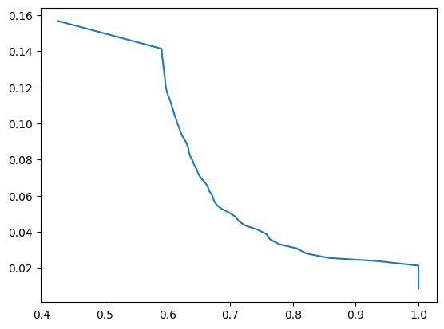

<b>Task 1</b>: Compare Model 1 and Model 2 on the TechTrack dataset using standard object-detection metrics.

In order to compar model 1 and model 2, we need to compare their precision and recall for each of the classes to determine which classes are classified best by each model. To do this, we will compute the precision recall curves. The area under these is an indicator of good the model classifies the object. 

<table style="width:100%">
  <tr>
    <th>Class</th>
    <th>Model 1</th>
    <th>Model 2</th>
  </tr>
  <tr>
    <td>
1</td>
    <td>
 0.162</td>
    <td>
0.167</td>
  </tr>
  <tr>
    <td>
2
</td>
    <td>
0.0535
</td>
    <td>
0.0507
</td>
  </tr>
</table>

